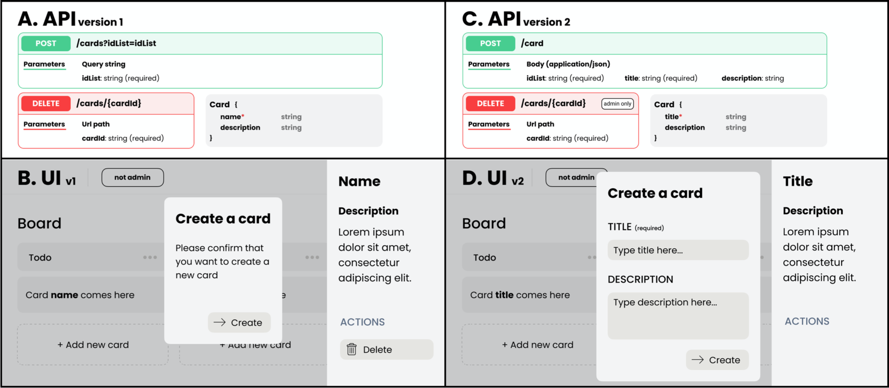

# Pivo

> An intent-based programming HTTP client to build evolvable-by-design clients of RESTful APIs

## Why Pivo? The problem statement.

Is has become common practice: we use RESTful APIs to access and manipulate data on frontend applications. And to build these frontends, we separate the view logic from the API interaction logic. While the view logic is materialized through components and routing, the API interaction logic is dispatched into entity-specific services.

As an example, we consider that we have the following API and want to build the following frontend application that is very similar to [Trello](https://trello.com). Here, we will focus on the components that detail and enable the creation of a card.



To create a card into a list, a `POST` request must be sent to `/cards?idList={idList}`. It would return the created card in the response body. Then, to name and describe the card, another request must be sent to update it after its creation. And to delete it, a `DELETE` request must be sent to `/cards/{cardId}`.

To implement the card creation component and mecanism with [React](https://reactjs.org/), we would write the following code to be compatible with the first version of the API:

```jsx
const CardCreationComponent = ({ idList }) =>
  <div>
    <h1>Create a card</h1>
    <p>Please confirm that [...]</p>
    <button onClick={() => CardService.createCard(idList)}>Create</button>
  </div>

class CardService {
  function createCard(idList) {
    Http.post('/cards?idList=' + idList)
  }
}
```

On the other hand, to display the detail of a `Card`, we would write this code:

```jsx
const CardDetailsComponent = ({ card }) =>
  <right-pane>
    <h1>{card.name}</h1>
    <h2>Description</h2>
    <p>{card.description}</p>
    <h2>ACTIONS</h2>
    <button onClick={() => CardService.delete(card)}>Delete</button>
  </right-pane>

class CardService {
  function deleteCard(cardId) {
    Http.delete('/cards/' + cardId)
  }
}
```

Yes, this code would not work with the second version of the API. Indeed, it would not send the required `title` parameter to create a card and would send the request to the wrong URI. Moreover, it would not hide the delete button when the user is not an admin and would be unable to display the title of a Card, because it looks for `card.name` and not `card.title`.

As a consequence, the code of the frontend have to be maintained to ensure that it will not break. Unfortunately, this task is no fun, time-consuming and error prone.

Among the changes that require to update the code, we distinguish the changes to:

1. An URI schema
2. The parameters of an operation
3. The response data schema
4. Access rights and business rules
5. The deletion of elements

We give a more [detailed taxonomy of API changes](https://cheronantoine.gitbook.io/ph-d/api-client-evolution/evolution-space) on our Gitbook.

## Pivo proposition

Instead of writing such likely-to-break code, we propose you to write code that will not break when the API evolve. Then, you might wonder what it looks like?

Going back to the previous example, we propose to write the following code on the frontend to create a card:

```jsx
const CardCreationComponent = ({ idList }) => {
  const createCardOperation = CardService.getCreateCardOperation(idList)
  return <div>
    <h1>Create a card</h1>
    <form generateInputsFor={createCardOperation.parametersSchema} />
    <button onClick={(formValues) => createCardOperation.invoke(formValues)}>Create</button>
  </div>
}

class CardService {
  apiDocumentation = fetchLatestApiDocumentation()
  function getCreateCardOperation(idList) {
    const parameters = { '/api/docs/dictionary#listId': idList }
    return this.apiDocumentation
      .findOperationThat('/docs/dictionary#createCard')
      .withDefaultParameters(parameters)
  }
}
```

Hence, you can notice three major differencies:

1. The HTTP request (URL and parameters) is built within the api documentation class (line 6), to ensure it is compliant with the latest version of the API.
2. Operations and parameters are identified by machine-interpretable semantics (see [OWL](https://www.w3.org/TR/owl-features/)) instead of ambiguous keywords (line 14 & 16), to enable the api documentation class to read the api documentation and make sense of it.
3. The form to let the user input the operations' parameter value is generated by the frontend based on the operation schema retrieved in the api documentation. Combined with 1 it ensures that all parameters will be sent to the API in the expected format.

These differencies enable the implementation of frontend applications that do not break when the API evolves. We qualify such kind as frontends of being **_evolvable-by-design_**.

Accordingly, to display the detail of a `Card`, we propose to write the following code:

```jsx
const CardDetailsComponent = ({ card }) =>
  <right-pane>
    <h1>{card.get('/api/docs/dictionary#name')}</h1>
    // Description and actions heading
    <if test={card.isOperationAvailable('/api/docs/dictionary#deleteAction')}>
      <button onClick={() => CardService.delete(card)}>Delete</button>
    </if>
  </right-pane>

class CardService {
  const apiDocumentation = fetchLatestApiDocumentation()
  function deleteCard(card) {
    card.invokeOperation('/api/docs/dictionary#deleteAction', apiDocumentation)
  }
}
```

Again, it uses machine-interpretable semantics to identify data in order to display the proper data to the user. So, a change of the keyword used in the API response does not break the frontend.

Also, the card instance has been enriched with information from the API documentation and hypermedia controls added to the API response. This is a requirement of this approach that we discuss later. Thus, this additional information is leveraged to test the availability of the `delete` operation. Also, to invoke it when the user clicks the delete button. Thanks to this mecanism, all access rights and business rules can be removed from the frontend. Hence, the developer can focus on visual logic code and user experience.

Apart from writing the frontend application slightly differently, as we just show you, two things are required from the API. First, a documentation of the API must be available and it must comply with some requirements that we detail in the [API compliance guide](/doc/not-ready-yet.md). Second, the API must send hypermedia controls in the response body. This is also detailed in the [API compliance guide](/doc/not-ready-yet.md).

## General Information

- At the moment the project is on GitHub because it is convenient for me to do so
- Readme in progress, I focus on the library at first and will document it when it will be ready to use
- Contributing guide not done yet
- Do not hesitate to get in touch with me for more information

## Todo

- Tests
- Support research function
- Make the library way more robust
